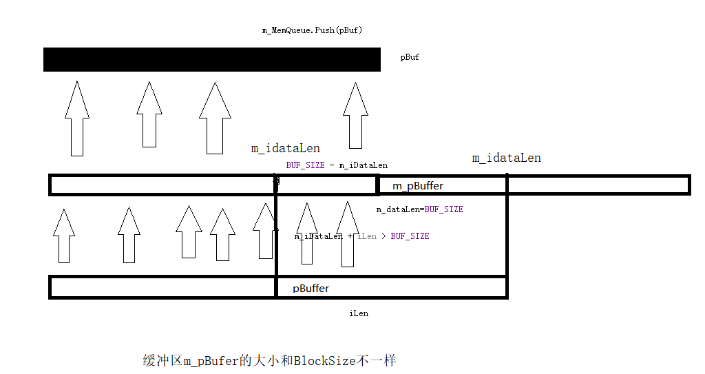

<h1> 需求 </h1>
====================

I really like using Markdown.<br><br>
I think I'll use it to format all of my documents from now on.<br><br>
<h2>1. 提供两个接口：read, write </h2>
read(buf,len) <br><br>
**buf:** 读缓冲区 <br><br>
**len:** 要读的数据长度 <br><br>

write(buf,len) <br><br>

*buf:* 要写入的数据缓冲区<br><br>
*len:* 要写入的数据长度<br><br>

```c++
int read()

int write()

```


